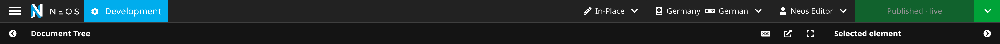

# Neos Backend Environment Display
This package allows you to display information about your environment (or any other arbitrary information) in-line with the neos brand-icon.

One use-case would be to show, whether you're currently using the Development, Staging or Production instance.



## Install

Install via composer2:

```shell
$ composer require punktde/neos-environment-display
```

## Setup
To configure the display, you will need to add settings to `Neos.Neos.Ui.frontendConfiguration.PunktDe.NeosEnvironmentDisplay`.

A sample configuration could look like this:

```yaml
Neos:
  Neos:
    Ui:
      frontendConfiguration:
        'PunktDe.NeosEnvironmentDisplay':
          backgroundColor: '#ff8700'
          label: 'Development'
          icon: 'cog'
```

These values could also be set via `.env`. You can also set discrete values for different environments using context-specific Configuration (`Configuration/{Production|Production/Staging|Development}/Settings.Neos.yaml`).

**NOTE: There is no default display value.**
